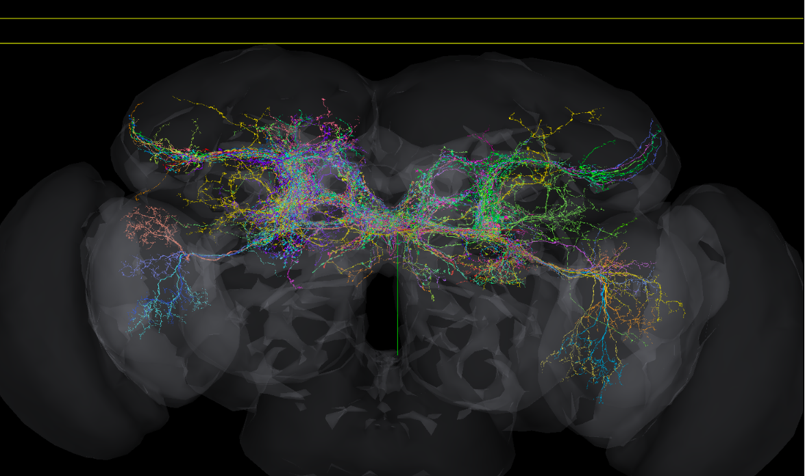

```{r setup}
library(fafbseg)
library(clipr)
library(neuprintr)
library(dplyr)
library(ggplot2)
```


# Variable Hemilineage-Hemilineage Connectivity. (EASY)
1. For hemilineage PSp3_dorsal, find all strong upstream and downstream partners on the FlyWire left side, right side, and the Hemibrain data.  
2. For Flywire, use the info table (in Python use Sea-Serpent to query programatically) to determine the hemilineage (where possible) of these partners. For Hemibrain data use the CBF-Hemilineage conversion.  
3. Plot hemilineage innervation data (upstream and downstream) for all three PSp3_dorsal sets.  
Compare the variability (ideally with a statistic) of hemilineage innervation between the three hemilineage sets.

## flywire 
```{r}
info = flytable_list_rows('info')
# clean up info for later use 
info = info[!info$status %in% c('not_a_neuron','bad_nucleus','duplicate'),]
lineage = flytable_query("SELECT supervoxel_id, root_id, side, ito_lee_hemilineage, status, proofread FROM info WHERE ito_lee_hemilineage='PSp3_dorsal'")
with(lineage, table(side, status, proofread))
```
Looks a bit asymmetric. Let's gt rid of some obvious unilateral ones: 
```{r}
# inspect in flywire
write_clip(lineage$root_id)
```

```{r}
to_exclude = c('720575940637957710','720575940603659878','720575940620374132','720575940610247859','720575940625528451','720575940627699712','720575940630448211','720575940630557727','720575940634532088','720575940627924227','720575940625045123','720575940631167315')
lineage = lineage %>% 
  filter(!root_id %in% to_exclude) %>% 
  filter(status != 'wrong_hemilineage')
```
After excluding these ones, it looks more symmetrical: 


```{r}
with(lineage, table(side, status))
```


```{r}
# get partners 
ptn.fw.det = flywire_partner_summary(lineage$root_id, partners = 'outputs', cleft.threshold = 30, method = 'spine')
# add side info 
ptn.fw.det = left_join(ptn.fw.det, lineage[c('root_id','side')], by = c('query' = 'root_id'))
head(ptn.fw.det)
```

```{r}
# only take into account cells in the info table 
ptn.fw.det.fil = ptn.fw.det[ptn.fw.det$post_id %in% info$root_id,]
# calculate synaptic weight between a post_id and all cells of the lineage on each side separately 
post_side_w = data.frame(post_id = character(),
                         side = character(),
                         weight = integer())
for (side in c('left','right')){
  post_side_w = rbind(post_side_w, 
                      data.frame(post_id = names(with(ptn.fw.det.fil[ptn.fw.det.fil$side == side,], tapply(weight, post_id, sum))),
                                 side = side, 
                                 weight = with(ptn.fw.det.fil[ptn.fw.det.fil$side == side,], tapply(weight, post_id, sum))))
}
post_side_w = post_side_w[post_side_w$weight>4,]
head(post_side_w)
```

```{r}
# get lineage info of the post_ids 
post_side_w_lin = left_join(post_side_w, info[c('root_id','ito_lee_hemilineage','status')], by = c('post_id' = 'root_id'))
head(post_side_w_lin)
```

```{r}
# make sure nothing is messed up where e.g. there are 2 rows on info pointed to the same neuron, in which case the row would be duplicated in the post_side_w_lin dataframe, over-counting the synapse numbers 
post_side_w_lin[duplicated(post_side_w_lin[c('post_id','side')]),]
```
Good.

```{r}
table(post_side_w_lin$status)
```

```{r}
# how many cells of each hemilineage (including NaN) on each side? 
with(post_side_w_lin, table(side, ito_lee_hemilineage))
```


```{r}
# eliminate the ones marked wrong_hemilineage 
post_side_w_lin$ito_lee_hemilineage[post_side_w_lin$status == 'wrong_hemilineage'] <- 'NaN'
```

```{r}
lin_side = post_side_w_lin %>% 
  aggregate(data = ., weight ~ ito_lee_hemilineage + side, sum) %>% 
  filter(weight > 100 & ito_lee_hemilineage != 'NaN')
head(lin_side)
```


```{r}
ptn.lin.fw %>% 
  qplot(data = ., weight, lineage)
```


## hemibrain 
The CBF corresponding to PSp3_dorsal is PVL13. 
```{r}
psp3d=neuprint_connection_table('cellBodyFiber:PVL13', partners='outputs', details = F)
psp3d_meta=neuprint_get_meta(unique(psp3d$partner))

lineage2cbf <- googlesheets4::read_sheet('https://docs.google.com/spreadsheets/d/11FHaJGEN9LQStf2OnKVMFP8N5gC0U54wSHlHK8bfVJI/edit#gid=1474562097')
```

```{r}
psp3d %>% 
  left_join(psp3d_meta[c("bodyid", "type", "cellBodyFiber")], by=c("partner"="bodyid")) %>% 
  left_join(lineage2cbf, by='cellBodyFiber') %>% 
  group_by(ItoLee_Hemilineage) %>% 
  summarise(n=n(), weight=sum(weight)) %>% 
  arrange(weight) %>% 
  # ggplot2 will turn the hemilineage into a factor ordered alphabetically
  # do this ourselves so that plot is in descending
  mutate(ItoLee_Hemilineage=factor(ItoLee_Hemilineage, levels = ItoLee_Hemilineage)) %>%
  filter(weight>100) %>% 
  filter(!is.na(ItoLee_Hemilineage)) -> lin_side.hb
head(lin_side.hb)
```

```{r}
names(lin_side.hb) = c('ito_lee_hemilineage','n', 'weight')
lin_side.hb$side = 'Hemibrain'
lin_side_all = rbind(lin_side,lin_side.hb[c('ito_lee_hemilineage', 'side', 'weight')])
ggplot(lin_side_all, aes(x = weight, y = ito_lee_hemilineage, col = side)) + 
  geom_point()
```
Doesn't actually seem so conserved... 

Ideally you'd normalise by the number of input synapses of the postsynaptic partner, to normalise synapse prediction between brains. This wasn't done here. 

# Variable Hemilineage Region Innervation. (HARD)
1. For hemilineage PSp3_dorsal, find the neuropil/region of interest of all upstream and downstream synapses on the FlyWire left side, right side, and the Hemibrain data.  
2.In NeuPrint, you can simply ask for the ROI, while in FlyWire you will have to check the location to the neuropil meshes (these are attached).  
3. You will probably need to loop through each synapse location and determine if it’s in the mesh for each neuropil region.  
4. Also important to note that the neuropils are a bit different between FAFB and hemibrain: e.g. in hemibrain the MB is divided into CA, PED, alpha, beta, alpha’, beta’ and gamma, but in FlyWire it’s CA, ML, PED, VL. It may be easier to just choose the primary neuropils in hemibrain as those are consistent (far as I can tell). You can list all primary ROIs in hemibrain in Python with roi_tree_text = fetch_roi_hierarchy(True, True, format='text').  
5. Plot neuropil/ROI innervation data (upstream and downstream) for all three PSp3_dorsal sets.  
6. Compare the variability (ideally with a statistic) of region innervation between the three hemilineage sets.  
7. Plot locations of pre- and post-synapses for chosen hemilineage in all 3 sets. (Choose your own difficulty)  
I would suggest 3 different plots.
If you need to, in Python you can use navis.xform_brain([data], source='FLYWIRE', target='JRC2018F') to transform Hemibrain locations to FlyWire locations.
Make this as pretty as possible, I’m personally envisioning something similar to Fig. 4A in this paper, but for one hemilineage instead of two. (Also this paper is quite cool I’d suggest a read).

